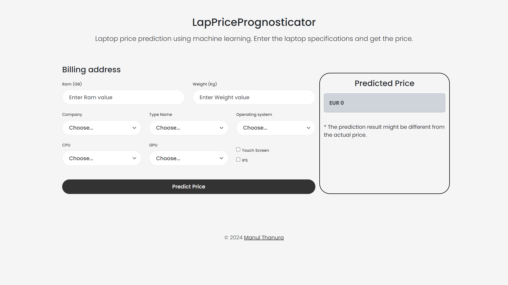

# LapPricePrognosticator

Welcome to the LapPricePrognosticator project! This project utilizes machine learning to predict the prices of laptops based on various features. The application is built using the Flask web framework and deployed on Microsoft Azure.

   

<!-- Add image -->

## Steps

### 01. problem statement

This is a regression problem. We have to predict the price of a laptop based on the features. The dataset is taken from kaggle. The dataset contains 1300 rows and 13 columns. That has coninuous values. The goal is to provide an accurate price prediction model that users can interact with via a web interface.

### 02. data analysis

In this section we analyze the data. We check for missing values, data types, and the distribution of the target variable. We also check for outliers and correlations between the features. After the analysis, we preprocess the data by encoding the categorical variables and scaling the numerical variables.

### 03. model building

In this section we build a machine learning model to predict the price of a laptop. We use the Random Forest Regressor algorithm to build the model. We use GridSearchCV to find the best hyperparameters for the model. We got 94% accuracy for the model.

### 04. build website

In this section we build a website using the Flask web framework. We create a form where users can input the features of a laptop and get a price prediction. We also create a results page where users can see the predicted price of the laptop.

### 05. deploy application

In this section we deploy the application on Microsoft Azure. Please refer requirements.txt file for the dependencies.

## License

Distributed under the MIT License. See LICENSE for more information.